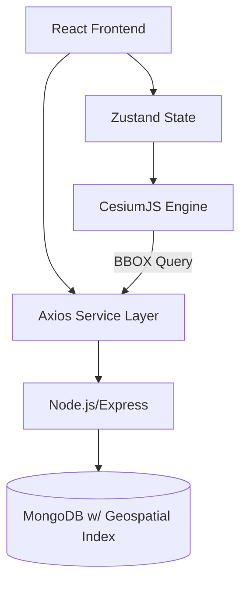

# TerraScope 3D: Enterprise Spatial Intelligence Platform

[](https://opensource.org/licenses/MIT)
[](https://cesium.com/cesiumjs/)
[](#performance-engineering)

TerraScope 3D is a high-performance, investment-grade geospatial intelligence engine designed for institutional Proptech investors and urban planners. It transforms raw spatial data into actionable investment insights through real-time analytics and advanced WebGL rendering.

## 🚀 Key Enterprise Features

### 🏙️ High-Density Urban Rendering
*   **Scalable Architecture:** Supports rendering thousands of properties with seamless performance.
*   **Spatial Indexing:** Backend powered by MongoDB `2dsphere` index for ultra-fast BBOX (Bounding Box) queries.
*   **Lazy Loading:** Intelligent data fetching that only loads assets within the viewer's frustum, automatically unloading distant entities to conserve memory.

### 📊 Investment Intelligence Layer
*   **Dynamic ROI Projections:** Real-time calculation of yield and appreciation rates.
*   **Multi-Factor Scoring:** Properties are ranked using a proprietary `Investment Score` formula:
    *   *Yield (40%) + Appreciation (50%) - Zoning Risk (10%)*
*   **Top Opportunities:** Automated identification of high-momentum assets in the visible region.
*   **Pro Analytics Mode:** High-fidelity radar charts for multi-dimensional asset evaluation.

### 🎨 Technical Sophistication
*   **Custom Shader Materials:** Dynamic HSL color gradients based on price-density ratios.
*   **Visual Hierarchy:** Soft-edge glows, selection pulses, and "Focus Mode" dimming for intuitive navigation.
*   **Camera Intelligence:** Cinematic fly-throughs with easing curves and tilt-constrained exploration.

## 🛠️ Performance Engineering

To meet Enterprise SaaS requirements, TerraScope 3D implements several low-level optimizations:

*   **Explicit Rendering Mode:** Uses Cesium's `requestRenderMode` to reduce GPU/CPU load by only rendering when scene changes occur.
*   **Reactive State Management:** Centralized Zustand store with memoized filtering logic to prevent unnecessary re-renders.
*   **Callback Properties:** Visual updates (pulses, highlights) are handled via Cesium `CallbackProperty`, avoiding expensive entity re-creations and minimizing memory pressure.
*   **Spatial Partitioning:** API-level BBOX filtering ensures the client never processes more data than necessary.

## 🏗️ Architecture Overview



## 🏁 Getting Started for Developers

### Prerequisites
- Node.js (v18+)
- NPM or Bun

### Installation & Run
1. **Server Setup**:
   ```bash
   cd terrascope-3d/server && npm install && npm start
   ```
2. **Client Setup**:
   ```bash
   cd terrascope-3d/client && npm install && npm run dev
   ```
3. **Environment**: Set `VITE_CESIUM_TOKEN` in `terrascope-3d/client/.env`.

## 🛤️ Scaling Roadmap

1.  **Phase 1 (Current):** High-density property visualization and investment scoring.
2.  **Phase 2:** Integration of real-time market transaction feeds and IoT occupancy sensors.
3.  **Phase 3:** Predictive AI modeling for 10-year neighborhood gentrification forecasting.
4.  **Phase 4:** Collaborative "War Room" mode for multi-user investment strategy sessions.

---

*This platform is designed for professional use. For access to the full dataset or API documentation, contact the enterprise support team.*
